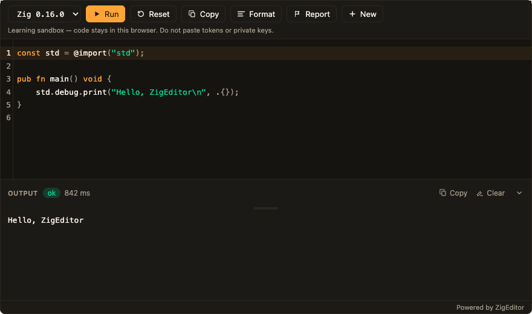
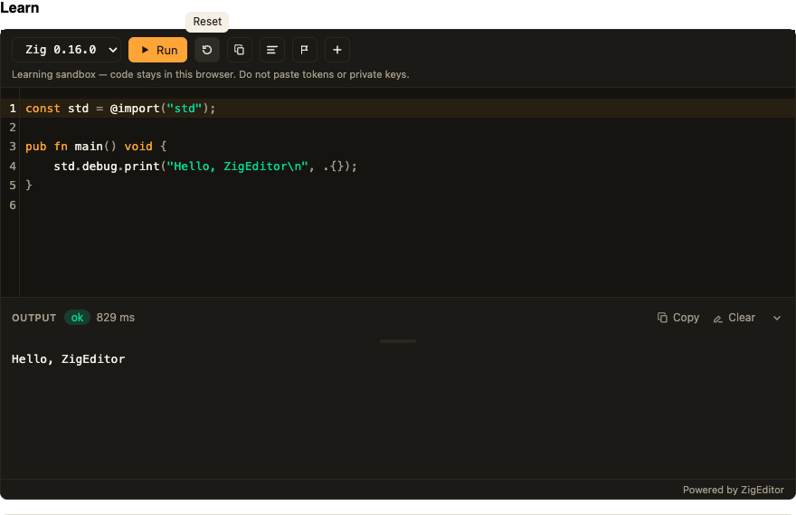

# ZigEditor

React component that edits Zig and runs it in the browser. The npm package ships the editor, the WASI host, and the worker. It does not ship `zig.wasm` or the standard library.

React and Next.js only. Render it from a client component. The worker is inside the package.

## Look

Playground keeps labeled buttons. Learn uses `compact` so the same controls are icons.





## Install

`pnpm add zigeditor` works after this package is published to npm.

Until then, build this repo and point the other app at that checkout:

```bash
git clone https://github.com/pratikmota/zigeditor.git
cd zigeditor
pnpm install
pnpm build
```

In the other app:

```bash
pnpm add ../zigeditor
```

`../zigeditor` is the path to that checkout. Peer dependencies: React 19 and `react-dom` 19. Copy this into a client component. Every control is on. Use the comment on that line to hide it.

```tsx
"use client";

import { useState } from "react";
import { HELLO_ZIG_SOURCE, ZigEditor } from "zigeditor";
import "zigeditor/styles.css";

const versions = [
  { id: "0.16.0", label: "Zig 0.16.0" },
  { id: "master", label: "Zig master" },
];

export function Editor() {
  const [code, setCode] = useState(HELLO_ZIG_SOURCE);
  const [version, setVersion] = useState(versions[0].id);

  return (
    <ZigEditor
      value={code}
      onChange={setCode}
      theme="dark" // "light" | "dark" | "system". Default is system.
      compact // icons with tooltips. Remove this line for labeled buttons.
      versions={versions} // one entry stays a one-item menu
      version={version}
      onVersionChange={setVersion}
      showRun // labeled Run. showRun={false} hides it.
      showReset // reset icon. showReset={false} hides it. onReset keeps the button and runs your confirm.
      showCopy // copy icon. showCopy={false} also hides the output Copy.
      showFormat // format icon, after the compiler loads. showFormat={false} hides it.
      showClear // output Clear. showClear={false} hides it.
      showCredit // “Powered by ZigEditor”. showCredit={false} hides it.
      newHref="/new" // plus icon, same tab. Omit to hide New.
      reportHref="https://example.com/report" // flag icon, new tab. Omit to hide Report.
      actions={[
        { label: "Share", icon: "share", onClick: () => {} }, // share icon. Replace onClick. Delete this object to hide it.
      ]}
      artifacts={{
        // Same-origin files you host. See “Compiler files” below.
        moduleUrl: "/wasm/0.16.0/zig.wasm",
        stdUrl: "/wasm/0.16.0/std.tar.gz",
        compilerRtUrl: "/wasm/0.16.0/compiler_rt.a",
      }}
    />
  );
}
```

Import `zigeditor/styles.css` once. A registry install resolves that file. A sibling `pnpm add ../zigeditor` does not, until the Next app sets `turbopack.root` to a directory that contains both checkouts. Hosts can override any `--ze-*` variable on `.zig-editor`.

Hosts that set a Content-Security-Policy need `worker-src 'self' blob:` and `wasm-unsafe-eval` on `script-src`.

## Demo

From this repo, `pnpm dev` builds the package and starts the Vite demo in `examples/vite`. Without compiler files the demo uses the mock runner. For a real Hello World, copy `toolchain/publish/0.16.0` to `examples/vite/public/wasm/0.16.0`. Building those files is in [toolchain/README.md](toolchain/README.md).

## Compiler files

Two ways to point at a compiler:

1. Pass `artifacts` with `moduleUrl`, `stdUrl`, and `compilerRtUrl`, as above. Same-origin hosting needs no CORS.
2. Omit `artifacts`. The package then uses `DEFAULT_ARTIFACT_BASE_URL` in `src/default-artifacts.ts`. That constant is an empty string until a real host exists, so callers must pass `artifacts`. When a CDN is live, set the constant to the version directory (trailing slash optional), rebuild, and publish the npm package:

```ts
export const DEFAULT_ARTIFACT_BASE_URL = "https://cdn.example.com/zig/0.16.0";
```

The base expands to `{base}/zig.wasm`, `{base}/std.tar.gz`, and `{base}/compiler_rt.a`. `LICENSE` and `NOTICE` sit beside those files for people and are not fetched by the host.

If the files are missing or the load fails, the editor uses the mock preview runner. Run results then have `preview: true`.

The browser fetches artifacts with `fetch` from the worker. A cross-origin CDN must send `Access-Control-Allow-Origin` for the app origins you care about, or `*`. Paths include the version directory (`/0.16.0/zig.wasm`), so a new Zig version is a new path. Those immutable files can use a long cache lifetime (`Cache-Control: public, max-age=31536000, immutable`).

Building the files is a maintainer task. Clone this repo and follow [toolchain/README.md](toolchain/README.md). The npm tarball does not contain `build.zig`.

## Caps

- Source larger than 64KB is rejected before `zig.wasm` starts.
- Default budgets: load 120s, compile 60s, run 2s. Pass `loadTimeoutMs`, `compileTimeoutMs`, or `runTimeoutMs` to change them.
- Guest code has no network.
